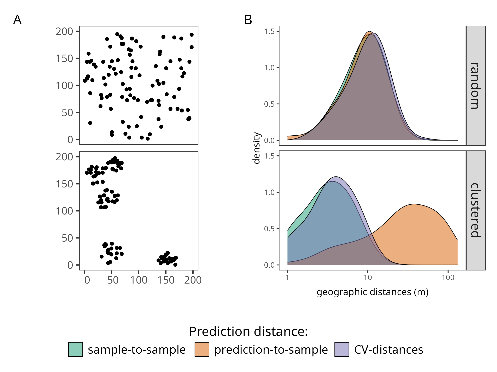

This repository contains figures and the corresponding code to reproduce them. 
They are made by the members of [the Remote Sensing and Spatial Modelling research group, Institute of Landscape Ecology, University of Münster](https://www.uni-muenster.de/RemoteSensing/en/).

## Gallery

### CV figures (`src/cv_figures.qmd`)

**Comparison of random and clustered sampling designs and their effects on distance distributions and cross-validation.**


## License

All figures are available under the [](https://creativecommons.org/licenses/by/4.0/).
This means you are free to **share and adapt** them, as long as proper attribution is given.  

## Citation

If you use material from this repository, please provide proper attribution.
Each figure and corresponding R script may have **different authors**.
Please check the metadata (author information provided with each figure/script) and cite accordingly.

For example, if you use a specific figure, you can cite it like this:

```
Author(s) (YEAR). "Figure Title." In: rs-figures: Figures and R Code for Reproducible Research. Research Group of Remote Sensing and Spatial Modelling, Institute of Landscape Ecology, University of Münster. Available at: https://github.com/LOEK-RS/rs-figures. License: CC BY 4.0
```

Or you can use the following BibTeX entry as a template:

```bibtex
@misc{rs_figures_<shortid>,
  author       = {Author(s)},
  title        = {{Figure Title} [Figure]},
  year         = {Year},
  editor       = {{Research Group of Remote Sensing and Spatial Modelling}},
  institution  = {Institute of Landscape Ecology, University of Münster},
  howpublished = {\url{https://github.com/LOEK-RS/rs-figures}},
  note         = {Licensed under CC BY 4.0}
}
```
